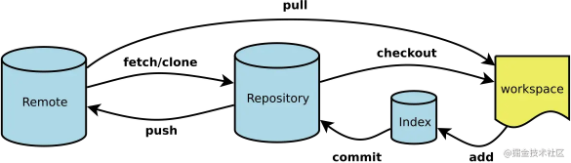
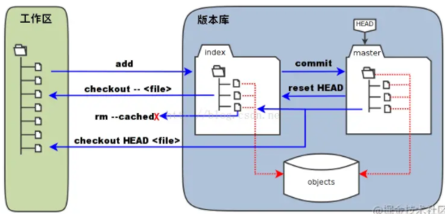
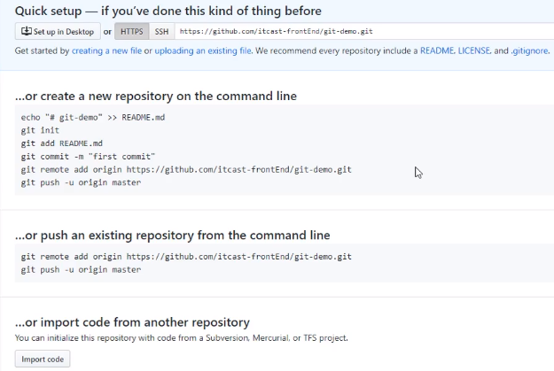
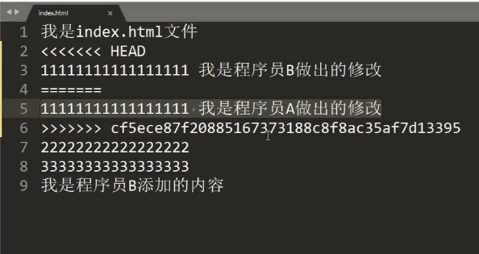
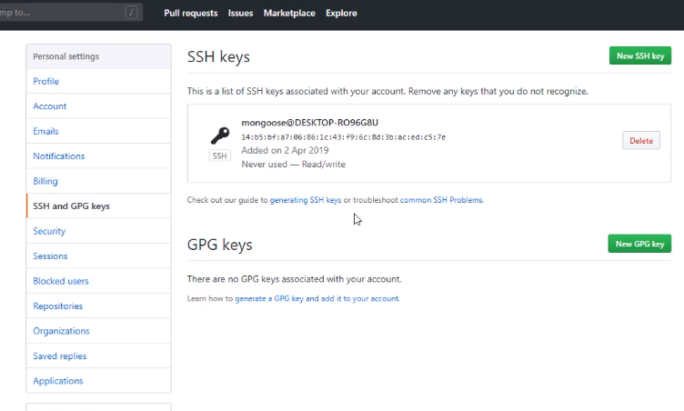
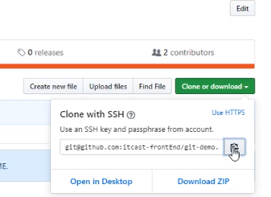

# Git 和 GitHub 详解

## （一）Git 基础

### Git 下载和安装

- 下载地址： https://git-scm.com/downloads
- 使用默认值安装
- 资源管理器内单击鼠标右键选择 `Git Bash Here`
- 输入`git --version` 检查是否安装成功

### Git 基本工作流程

> 
>
> 主要涉及到四个关键点：
>
> 1. 工作区：本地电脑存放项目文件的地方，比如 learnGitProject 文件夹；
> 2. 暂存区（Index/Stage）：在使用 git 管理项目文件的时候，其本地的项目文件会多出一个.git 的文件夹，将这个.git 文件夹称之为版本库。其中.git 文件夹中包含了两个部分，一个是暂存区（Index 或者 Stage）,顾名思义就是暂时存放文件的地方，通常使用 add 命令将工作区的文件添加到暂存区里；
> 3. 本地仓库：.git 文件夹里还包括 git 自动创建的 master 分支，并且将 HEAD 指针指向 master 分支。使用 commit 命令可以将暂存区中的文件添加到本地仓库中；
> 4. 远程仓库：不是在本地仓库中，项目代码在远程 git 服务器上，比如项目放在 github 上，就是一个远程仓库，通常使用 clone 命令将远程仓库拷贝到本地仓库中，开发后推送到远程仓库中即可；
>
> 更细节的来看：
>
> 
>
> 日常开发时代码实际上放置在工作区中，也就是本地的 XXX.java 这些文件，通过 add 等这些命令将代码文教提交给暂存区（Index/Stage），也就意味着代码全权交给了 git 进行管理，之后通过 commit 等命令将暂存区提交给 master 分支上，也就是意味打了一个版本，也可以说代码提交到了本地仓库中。另外，团队协作过程中自然而然还涉及到与远程仓库的交互。
>
> 因此，经过这样的分析，git 命令可以分为这样的逻辑进行理解和记忆：
>
> 1. git 管理配置的命令；
>
>    **几个核心存储区的交互命令：**
>
> 2. 工作区与暂存区的交互；
>
> 3. 暂存区与本地仓库（分支）上的交互；
>
> 4. 本地仓库与远程仓库的交互。
>
> 作者：你听\_\_\_
> 链接：https://juejin.im/post/5ae072906fb9a07a9e4ce596
> 来源：掘金

| 工作目录          | 暂存区               | git 仓库             | 远程仓库     |
| ----------------- | -------------------- | -------------------- | ------------ |
| 被 Git 管理的项目 | 临时存放被修改的文件 | 目录用于存放提交记录 | 远程代码仓库 |
| `git init`        | `git add`            | `git commit`         | `git push`   |

### Git 使用前的配置命令

在使用前告诉 git 你是谁：

1. 第一次使用 git，配置用户信息

   1. 配置用户名：`git config --global user.name "your name"`;
   2. 配置用户邮箱：`git config --global user.email "youremail@github.com"`;

2. > 查询配置信息

   1. 列出当前配置：`git config --list`;
   2. 列出 repository 配置：`git config --local --list`;
   3. 列出全局配置：`git config --global --list`;
   4. 列出系统配置：`git config --system --list`;

3. > 其他配置

   1. 配置解决冲突时使用哪种差异分析工具，比如要使用 vimdiff：`git config --global merge.tool vimdiff`;
   2. 配置 git 命令输出为彩色的：`git config --global color.ui auto`;
   3. 配置 git 使用的文本编辑器：`git config --global core.editor vi`;

4. > 注：

   1. 更改-->重复上述命令
   2. 也可直接修改 `C:\Users\用户\.gitconfig`

### 工作区上的操作命令

#### 提交步骤

1. `git init` 初始化 git 仓库

   > > 新建仓库
   >
   > 1. 将工作区中的项目文件使用 git 进行管理，即创建一个新的本地仓库：`git init`；
   > 2. 从远程 git 仓库复制项目：`git clone `; 克隆项目时如果想定义新的项目名，可以在 clone 命令后指定新的项目名：`git clone git://github.com/wasd/example.git NewName`；

2. `git status` 查看文件状态

   > > 查新信息
   >
   > 1. 查询当前工作区所有文件的状态：`git status`;
   > 2. 比较工作区中当前文件和暂存区之间的差异，也就是修改之后还没有暂存的内容：git diff；指定文件在工作区和暂存区上差异比较：`git diff `;

3. `git add 文件/文件列表` 提交到暂存区

   > > 提交
   >
   > 1. 提交工作区所有文件到暂存区：`git add .`
   > 2. 提交工作区中指定文件到暂存区：`git add ...`;
   > 3. 提交工作区中某个文件夹中所有文件到暂存区：`git add [dir]`;

4. `git commit -m 提交信息` 向仓库提交代码

   > > 提交文件到版本库
   >
   > 1. 将暂存区中的文件提交到本地仓库中，即打上新版本：`git commit -m "commit_info"`;
   > 2. 将所有已经使用 git 管理过的文件暂存后一并提交，跳过 add 到暂存区的过程：`git commit -a -m "commit_info"`;
   > 3. 提交文件时，发现漏掉几个文件，或者注释写错了，可以撤销上一次提交：`git commit --amend`;

5. `git log` 查看提交记录

   > > 查看信息
   >
   > 1. 比较暂存区与上一版本的差异：`git diff --cached`;
   > 2. 指定文件在暂存区和本地仓库的不同：`git diff --cached`;
   > 3. 查看提交历史：git log；参数`-p`展开每次提交的内容差异，用`-2`显示最近的两次更新，如`git log -p -2`;

#### 撤销

- 用暂存区中的文件覆盖工作目录中的文件：`git checkout -- 文件名` 不加 `-- 文件名`则覆盖全部文件

- 将文件从暂存区中删除：`git rm --cached 文件名`

- 将 git 仓库中指定的更新记录恢复出来，并且覆盖暂存区和工作目录：` git reset --hard commitID`

- > > 撤销
  >
  > 1. 删除工作区文件，并且也从暂存区删除对应文件的记录：`git rm `;
  > 2. 从暂存区中删除文件，但是工作区依然还有该文件:`git rm --cached `;
  > 3. 取消暂存区已经暂存的文件：`git reset HEAD ...`;
  > 4. 撤销上一次对文件的操作：`git checkout --`。要确定上一次对文件的修改不再需要，如果想保留上一次的修改以备以后继续工作，可以使用 stashing 和分支来处理；
  > 5. 隐藏当前变更，以便能够切换分支：`git stash`；
  > 6. 查看当前所有的储藏：`git stash list`；
  > 7. 应用最新的储藏：`git stash apply`，如果想应用更早的储藏：`git stash apply stash@{2}`；重新应用被暂存的变更，需要加上`--index`参数：`git stash apply --index`;
  > 8. 使用 apply 命令只是应用储藏，而内容仍然还在栈上，需要移除指定的储藏：`git stash drop stash{0}`；如果使用 pop 命令不仅可以重新应用储藏，还可以立刻从堆栈中清除：`git stash pop`;
  > 9. 在某些情况下，你可能想应用储藏的修改，在进行了一些其他的修改后，又要取消之前所应用储藏的修改。Git 没有提供类似于 stash unapply 的命令，但是可以通过取消该储藏的补丁达到同样的效果：`git stash show -p stash@{0} | git apply -R`；同样的，如果你沒有指定具体的某个储藏，Git 会选择最近的储藏：`git stash show -p | git apply -R`；
  >
  > > 更新文件
  >
  > 1. 重命名文件，并将已改名文件提交到暂存区：`git mv [file-original] [file-renamed]`;

## （二）Git 进阶

### 分支

生成副本，避免影响开发主线

#### 分支细分

1. 主分支（master）：第一次向 git 仓库提交更新记录时自动产生的一个分支。
2. 开发分支（develop）：作为开发的分支，基于 master 分支创建。
3. 功能分支（feature）：作为开发具体功能的分支基于开发分支创建。

#### 分支命令

- `git branch` 查看分支
- `git branch 分支名称` 创建分支
- `git checkout 分支名称` 切换分支
- `git merge 来源分支` 合并分支
- `git branch -d 分支名称` 删除分支（分支合并后才允许被删除）（-D 大写强制删除）
  - `git push origin :branch-name` : 远程仓库同步删除掉的分支

注意：

​ 开发分支文件后要 `commit` 后再切换主分支，否则分支文件会出现在主分支里面。

> > 分支管理
>
> 1. 创建分支：`git branch `，如`git branch testing`；
> 2. 从当前所处的分支切换到其他分支：`git checkout `，如`git checkout testing`；
> 3. 新建并切换到新建分支上：`git checkout -b `;
> 4. 删除分支：`git branch -d `；
> 5. 将当前分支与指定分支进行合并：`git merge `;
> 6. 显示本地仓库的所有分支：`git branch`;
> 7. 查看各个分支最后一个提交对象的信息：`git branch -v`;
> 8. 查看哪些分支已经合并到当前分支：`git branch --merged`;
> 9. 查看当前哪些分支还没有合并到当前分支：`git branch --no-merged`;
> 10. 把远程分支合并到当前分支：`git merge /`，如`git merge origin/serverfix`；如果是单线的历史分支不存在任何需要解决的分歧，只是简单的将 HEAD 指针前移，所以这种合并过程可以称为快进（Fast forward），而如果是历史分支是分叉的，会以当前分叉的两个分支作为两个祖先，创建新的提交对象；如果在合并分支时，遇到合并冲突需要人工解决后，再才能提交；
> 11. 在远程分支的基础上创建新的本地分支`：git checkout -b /`，如`git checkout -b serverfix origin/serverfix`;
> 12. 从远程分支 checkout 出来的本地分支，称之为跟踪分支。在跟踪分支上向远程分支上推送内容：`git push`。该命令会自动判断应该向远程仓库中的哪个分支推送数据；在跟踪分支上合并远程分支：`git pull`；
> 13. 将一个分支里提交的改变移到基底分支上重放一遍：`git rebase `，如`git rebase master server`，将特性分支 server 提交的改变在基底分支 master 上重演一遍；使用 rebase 操作最大的好处是像在单个分支上操作的，提交的修改历史也是一根线；如果想把基于一个特性分支上的另一个特性分支变基到其他分支上，可以使用`--onto`操作：`git rebase --onto `，如`git rebase --onto master server client`；使用 rebase 操作应该遵循的原则是：**一旦分支中的提交对象发布到公共仓库，就千万不要对该分支进行 rebase 操作**；

### 暂时保存更改

git 中可以不提交更改，只提取分支上所有改动并储存，让开发人员得到一个干净的副本，临时转向其它工作。复制到“剪切板”，可以“粘贴“到其它分支。

场景：

- 储存临时改动：`git stash`
- 恢复临时改动：`git stash pop`

### 打标签

> Git 使用的标签有两种类型：**轻量级的（lightweight）和含附注的（annotated）**。轻量级标签就像是个不会变化的分支，实际上它就是个指向特定提交对象的引用。而含附注标签，实际上是存储在仓库中的一个独立对象，它有自身的校验和信息，包含着标签的名字，电子邮件地址和日期，以及标签说明，标签本身也允许使用 GNU Privacy Guard (GPG) 来签署或验证。一般我们都建议使用含附注型的标签，以便保留相关信息；当然，如果只是临时性加注标签，或者不需要旁注额外信息，用轻量级标签也没问题。
>
> 1. 列出现在所有的标签：`git tag`;
> 2. 使用特定的搜索模式列出符合条件的标签，例如只对 1.4.2 系列的版本感兴趣：`git tag -l "v1.4.2.*"`;
> 3. 创建一个含附注类型的标签，需要加`-a`参数，如`git tag -a v1.4 -m "my version 1.4"`;
> 4. 使用 git show 命令查看相应标签的版本信息，并连同显示打标签时的提交对象：`git show v1.4`;
> 5. 如果有自己的私钥，可以使用 GPG 来签署标签，只需要在命令中使用`-s`参数：`git tag -s v1.5 -m "my signed 1.5 tag"`;
> 6. 验证已签署的标签：git tag -v ，如`git tag -v v1.5`;
> 7. 创建一个轻量级标签的话，就直接使用 git tag 命令即可，连`-a`,`-s`以及`-m`选项都不需要，直接给出标签名字即可，如`git tag v1.5`;
> 8. 将标签推送到远程仓库中：git push origin ，如`git push origin v1.5`；
> 9. 将本地所有的标签全部推送到远程仓库中：`git push origin --tags`;

## （三）Github

### 注册 Github 账号

略~

### 多人协作开发流程

- A 在自己的计算机中创建本地仓库
- A 在 GitHub 中创建远程仓库
- A 将本地仓库推送到远程仓库
- B 克隆远程仓库到本地进行开发
- B 将本地仓库开发内容推送到远程仓库
- A 将远程仓库中的最新内容拉去本地

### 创建远程仓库



### 推送到远程仓库

1. `git push 远程仓库地址 分支名称`

2. `git push 远程仓库地址别名 分支名称`

3. `git push -u 远程仓库地址别名 分支名称`

   `-u` 记住推送地址和分支，下次只需要输入`git push`

4. `git remote add 远程仓库地址别名 远程仓库地址`

5. 删除别名：`git remote remove 远程仓库地址别名`

6. 第一次提交需要用户名和密码，电脑会记住密码在凭据管理器，第二次就不用了。

7. > ### 本地仓库上的操作
   >
   > 1. 查看本地仓库关联的远程仓库：`git remote`；在克隆完每个远程仓库后，远程仓库默认为`origin`;加上`-v`的参数后，会显示远程仓库的`url`地址；
   > 2. 添加远程仓库，一般会取一个简短的别名：`git remote add [remote-name] [url]`，比如：`git remote add example git://github.com/example/example.git`;
   > 3. 从远程仓库中抓取本地仓库中没有的更新：`git fetch [remote-name]`，如`git fetch origin`;使用 fetch 只是将远端数据拉到本地仓库，并不自动合并到当前工作分支，只能人工合并。如果设置了某个分支关联到远程仓库的某个分支的话，可以使用`git pull`来拉去远程分支的数据，然后将远端分支自动合并到本地仓库中的当前分支；
   > 4. 将本地仓库某分支推送到远程仓库上：`git push [remote-name] [branch-name]`，如`git push origin master`；如果想将本地分支推送到远程仓库的不同名分支：`git push :`，如`git push origin serverfix:awesomebranch`;如果想删除远程分支：`git push [romote-name] :`，如`git push origin :serverfix`。这里省略了本地分支，也就相当于将空白内容推送给远程分支，就等于删掉了远程分支。
   > 5. 查看远程仓库的详细信息：`git remote show origin`；
   > 6. 修改某个远程仓库在本地的简称：`git remote rename [old-name] [new-name]`，如`git remote rename origin org`；
   > 7. 移除远程仓库：`git remote rm [remote-name]`；

### 拉取仓库

#### 克隆仓库

- 克隆远程仓库到本地：`git clone 仓库地址`

#### 拉取远程仓库中最新版本

- 拉取远程仓库最新版本到本地：` git pull 远程仓库地址 分支名称`

### 解决冲突

多人开发同一个项目时，如果两个人修改了同一个文件同一个地方

1. ` git pull`
2. 手动解决冲突
3. ` git push`



### 跨团队协作

1. ` fork`到自己的远程仓库
2. ` clone`到本地进行修改
3. ` push`到远程仓库
4. ` pull request`发送给原作者
5. 原作者查看`commit` 审核
6. 原作者 ` merge pull request`

### SSH 免密登录

1. 生成密钥：` ssh-keygen`

   密匙储存目录：` C:\User\用户\.ssh`

   公钥名称：` id_rsa.pub`

   私钥名称：` id_rsa`

2. Github 添加公钥



3. 复制 SSH 地址：

   

4. 设置 ssh 别名：`$ git remote add origin_ssh SSH地址 `

5. 远程推送：` $ git push origin_ssh master`

6. [ubuntu git 环境搭建以及通过 SSH 连接 Github（免密码）配置](https://segmentfault.com/a/1190000013154540)

### Git 忽略清单

将不需要的文件名字添加到此文件中，执行 git 命令时就会忽略这些文件。

- git 忽略清单文件名称：`.gitignore`

- 将工作目录所有文件添加到缓存区：` git add .`

- 例子：

  ```gitignore
  # 此为注释 – 将被 Git 忽略
  # 忽略所有 .a 结尾的文件
  *.a
  # 但 lib.a 除外
  !lib.a
  # 仅仅忽略项目根目录下的 TODO 文件，不包括 subdir/TODO
  /TODO
  # 忽略 build/ 目录下的所有文件
  build/
  # 会忽略 doc/notes.txt 但不包括 doc/server/arch.txt
  doc/*.txt
  # 忽略 doc/ 目录下所有扩展名为 txt 的文件
  doc/**/*.txt
  ```

### 为仓库添加说明

在仓库根目录添加`readme.md`文件即可

## （四）使用 SourceTree 管理 Git

> https://blog.csdn.net/u012230055/article/details/64125268

### 一 、SourceTree 简介

SourceTree 是 Windows 和 Mac OS X 下免费的 [Git](http://lib.csdn.net/base/git) 和 Hg 客户端，拥有可视化界面，容易上手操作。同时它也是 Mercurial 和 Subversion[版本控制](http://lib.csdn.net/base/git)系统工具。支持创建、提交、clone、push、pull 和 merge 等操作。

### 二、下载安装 SourceTree 步骤

1. 下载地址：https://www.sourcetreeapp.com/，该版本是中文的，下载完成后可以进行安装。

2. 点击“install”，安装完成后，打开 sourcetree，点击“user an existing account”

3. 注意：使用谷歌帐号登录即可，前提是你必须可以上谷歌才可以。

4. 直接点击“跳过初始设置”即可。

5. 登录注册成功后，弹出设置 puttykey 的界面，点击“取消”即可。

6. 点击“取消”按钮，弹出如下提示框：
   

   此时进入到 sourcetree 的主界面，现在就可以使用 sourcetree 啦。

### 三、集成文件对比插件

安装对比插件

Sourcetree 中集成 Beyond Compare 4，当文件冲突时可以很好的解决冲突。安装过程很简单，这里不再详述。

Sourcetree 中配置 Beyond Compare 4

菜单栏，“工具”——“选项”，如图所示：


选择“比较”选项卡，然后将红色方框处的内容修改为如图所示：


### 四、SourceTree 基本使用

#### （1）克隆

点击克隆按钮，克隆项目：
既可以是本地已有的 git 项目，也可以是远程目录中的项目，


​ 本地存在的 git 项目，
​ 获取项目克隆地址，点击克隆按钮，如图所示：


​ 1、克隆项目的路径
​ 2、克隆项目存放的位置
​ 3、如果要下载特定的分支，可以按分支进行下载

#### （2）配置忽略文件

​ 利用.gitignore 过滤文件，如编译过程中的中间文件，等等，这些文件不需要被追踪管理。
​ .gitignore 文件只对还没有加入版本管理的文件起作用，如果之前已经用 git 把这些文件纳入了版本库，就不起作用了
​ 使用 sourcetree 添加忽略文件的方法：
​ 正常情况下，管理员创建项目后需要直接将忽略文件创建好。创建方法如图：


按照如上步骤操作即可编辑冲突文件。
冲突文件规则：
忽略文件夹（如：bin、obj）：
obj/
bin/
某目录下的所有.txt 文件，
obj/\*.txt
开发的过程中可能遇到一些忽略文件中未添加的文件，此时需要开发者自行添加忽略文件，添加方法如下：
之前已经介绍过未进行版本控制的或者受版本控制的文件，在 sourcetree 的“文件状态” 标签中查找，如图所示：


鼠标右键要忽略的文件，点击“忽略”，选择忽略的模式，即可将文件进行忽略，如图所示：


#### （3）tag 使用方法

​ 打 tag 的目的是在代码的主要节点处有个标记，方便下次修改代码时可以准确的找到想要找的代码。而无需看着日志文件逐一回忆要找的代码位置。


#### （4）分支管理与使用

​ 使用 sourcetree 创建和使用分支是很方便的，不像之前使用的 TortoiseGit 只能在当前代码处创建分支，使用 sourcetree 的方便之处：
​ 1、可以选择特定的某版本创建分支
​ 2、代码检出时可以按照分支进行检出
​ 3、分支的添加很简单
分支添加：


​ 1、可以在当前的版本下创建分支
​ 2、选择指定的提交创建分支
​ 3、点击“创建分支”
分支提交到服务器：
​ 在 sourcetree 右侧内容中的分支列表中，选中创建的分支，右键提交，如图所示：


分支合并：
1、分支合并功能和分支添加功能类似，这里不再详述，需要注意的是首先要切换到被合并的分支上，再进行合并操作。
2、分支合并时，可以选择具体的某提交进行合并，同时主分支可以合并到子分支；子分支可以合并到主分支；子分支之间也可以进行合并。

#### （5）GIT 与 SVN 同步

​ git svn 工具集在当前不得不使用 Subversion 服务器或者开发环境要求使用 Subversion 服务器的时候格外有用。不妨把它看成一个跛脚的 Git，在实际使用中不推荐这样使用 GIT。

#### （6）基本步骤

提交、拉取和推送
提交：
项目提交是为了维护本地版本库，如果本地有未提交的内容，则不允许拉取和推送；如图所示区域有内容时，则代表本地未提交的内容：


​ 点击 Stage All，填写提交信息既可以将本地内容（暂存区）提交到本地版本库，如图所示：


​ 1、将未暂存的文件进行暂存，如果有些文件不需要暂存，则可以进行删除，选中文件，右键“移除”即可。
​ 拉取：从远程将代码进行更新，相当于 SVN 的“更新”
​ 推送：将代码提交到远程。

#### （7）解决冲突

​ 简单介绍


​ 1、冲突文件的符号为“感叹号”
​ 2、选中“冲突文件”，右键——点击”解决冲突“——点击”打开外部合并工具“（备注：才操作时已经安装外部合并工具，同时在 sourcetree 中已经进行配置，详见”集成文件对比插件“）

​ 冲突界面

​ 冲突解决界面如下：可以根据需要选择内容显示类型，只”显示更改“，”显示冲突“或者”全部“


​ 解决冲突

​ 方法一：在相关的版本处，选中”冲突行”，合并区默认处于合并位置，鼠标右键，选择最终冲突地方留下的内容，如图：


​ 解决冲突之后效果图：


​ 1、冲突图标由”感叹号”——“省略号”。
​ 2、右侧显示修改后的代码进行查看。
​ 3、同时修改的冲突文件有相应的备份，大家可以下载到本地，方便冲突有问题再次修改文件。
备注：该文件下载之后请将版本库中的该文件删除，不要上传到版本库中。
​ 4、修改完冲突之后，需要再次提交，推送。大家养成提交时，提交有效的日志信息，不要将比如：123 之类的信息推送到服务器中。
​ 方法二：如果冲突非常少，可以直接在右侧栏中解决冲突，如图所示：


​ 1、点击未暂存区域的冲突文件。
​ 2、右侧列表中出现冲突的内容。
​ 3、选择冲突内容，解决冲突，如图所示：


​ 暂存行：表示保留该内容
​ 丢弃行：表示删除该内容
​ 备注：区分于第一种方式，使用第一种方法解决时，不要点击”未暂存文件”,否则可能无法打开冲突文件

#### （8）版本回退

​ 原则上，代码推送之前要保证本地的代码可运行，不要将不可运行或者有问题的代码推送到服务器上，如果由于误操作，将代码推送到了远程，想重新修改上传代码，此时，需要将版本进行回退，回 退方法如图：


​ 1、切换到日志/历史标签
​ 2、选择要恢复到的版本，如图蓝色位置
​ 3、鼠标右键，选择“重置当前分支到此次提交”
​ 4、选择”重置模式”，如图所示


​ 5、弹出框中选择”Yes”


#### （9）相关提示信息含义

​ 冲突信息


​ 先更新信息

​ 小窍门：

​ 如果推送时，拉取右上方显示数字，则需要先拉取再推送。

### 五、SourceTree&Git 部分名词解释

**克隆(clone)**：从远程仓库 URL 加载创建一个与远程仓库一样的本地仓库
**提交(commit)**：将暂存文件上传到本地仓库（我们在 Finder 中对本地仓库做修改后一般都得先提交一次，再推送）
**检出(checkout)**：切换不同分支
**添加（add）**：添加文件到缓存区
**移除（remove）**：移除文件至缓存区
**暂存(git stash)**：保存工作现场
**重置(reset)**：回到最近添加(add)/提交(commit)状态
**合并(merge)**：将多个同名文件合并为一个文件，该文件包含多个同名文件的所有内容，相同内容抵消
**抓取(fetch)**：从远程仓库获取信息并同步至本地仓库
**拉取(pull)**：从远程仓库获取信息并同步至本地仓库，并且自动执行合并（merge）操作，即 pull=fetch+merge
**推送(push)**：将本地仓库同步至远程仓库，一般推送（push）前先拉取（pull）一次，确保一致
**分支(branch)**：创建/修改/删除分枝
**标签(tag)**:给项目增添标签
**工作流(Git Flow)**:团队工作时，每个人创建属于自己的分枝（branch），确定无误后提交到 master 分枝
**终端(terminal)**:可以输入 git 命令行
